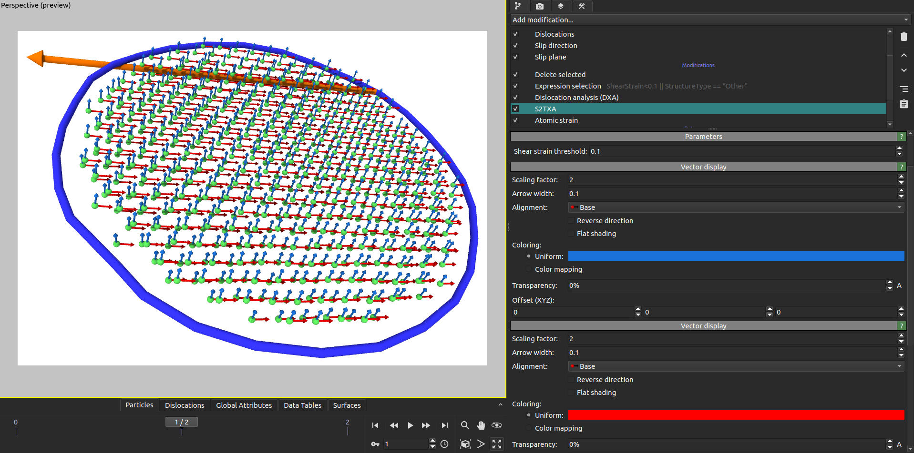
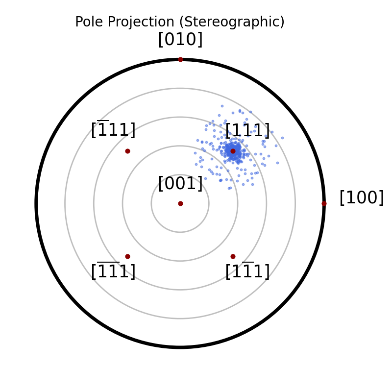

# S2TXA (Slip Systems Twinning eXtraction Algorithm)

Analyze the Deformation Gradient Tensor and extract associated slip direction and slip plane containing the deformation upon activation of plasticity or twinning.

## Description

The S2TXA algorithm performs basic and computational cheap operations on the deformation gradient tensor to extract :
  - normalized slip direction
  - normalizde slip plane

See the following publication for details:

  > Paul Lafourcade, Guillaume Ewald, Thierry Carrard, Christophe Denoual,
  > *Extraction of slip systems and twinning variants from a Lagrangian analysis of molecular dynamics simulations*
  > Mechanis of Materials (2025), Volume 200, Special Issue STAMS 2023 / SEMTA-MECAMAT COLLOQUIUM - Mechanics Across the Scales, Pages 105189
  > [https://doi.org/10.1016/j.mechmat.2024.105189](https://doi.org/10.1016/j.mechmat.2024.105189)
  
## Parameters 

| GUI name                        | Python name       | Description                                                      | Default Value |
|---------------------------------|-------------------|------------------------------------------------------------------|---------------|
| **Shear strain threshold**               | `alpha`          | Per-atom shear strain threshold value below which the S2TXA algorithm is not performed   | `0.1`         |


## GUI Screenshot



## Pole projection using ovitos script in examples/no_gui_S2TXA_modofier.py


  
## Installation

- OVITO Pro [integrated Python interpreter](https://docs.ovito.org/python/introduction/installation.html#ovito-pro-integrated-interpreter):
  ```
  ovitos -m pip install --user git+https://github.com/lafourcadep/S2TXA.git
  ``` 
  The `--user` option is recommended and [installs the package in the user's site directory](https://pip.pypa.io/en/stable/user_guide/#user-installs).

- Other Python interpreters or Conda environments:
  ```
  pip install git+https://github.com/lafourcadep/S2TXA.git
  ```

## Technical information / dependencies

- Tested on OVITO version 3.12.0

## Contact

Paul Lafourcade paul.lafourcade@cea.fr